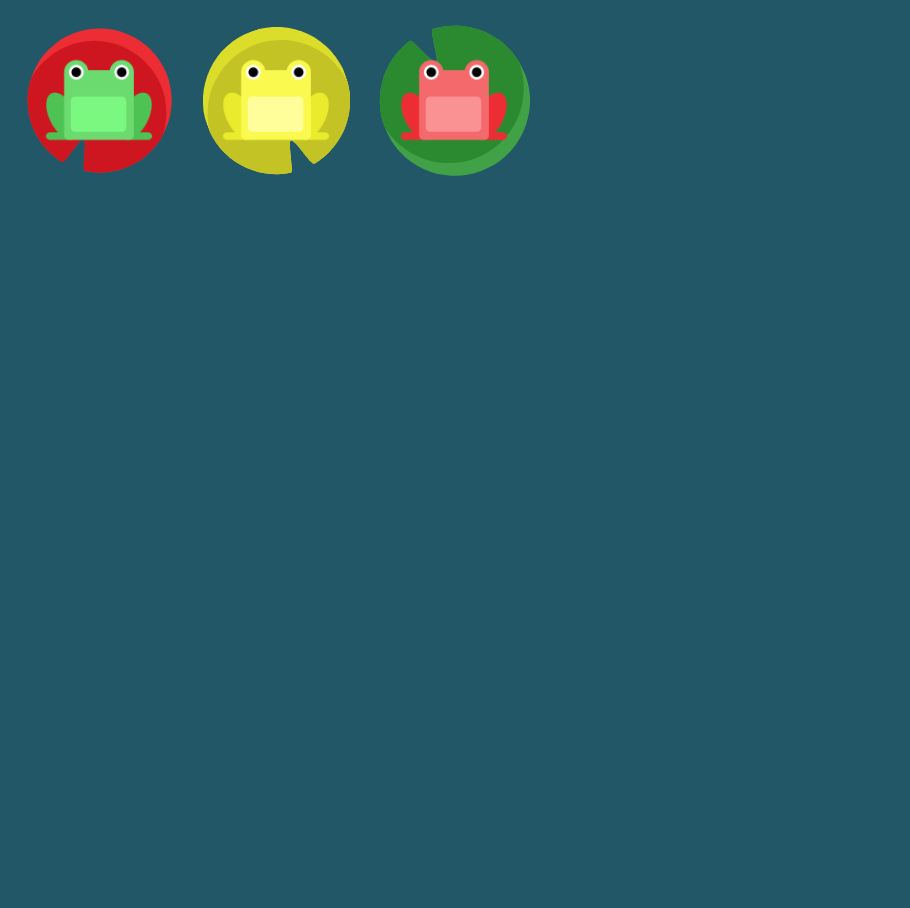

# Level 10 : flex-direction & justify-content

Combining `flex-direction` & `justify-content` practicing.

# Exercise



# Solution

:bulb: Basically just apply : 

```css
flex-direction: row-reverse;
justify-content: flex-end;
```

> `flex-direction: row-reverse;` will cause froggies to be place on row-end, that's why we need to apply a `justify-content` too. But :warning: row is now reversed so we need a `flex-end` and not a `flex-start` :eyes:

# Next step

[Link to next level](./level11.md) :muscle: