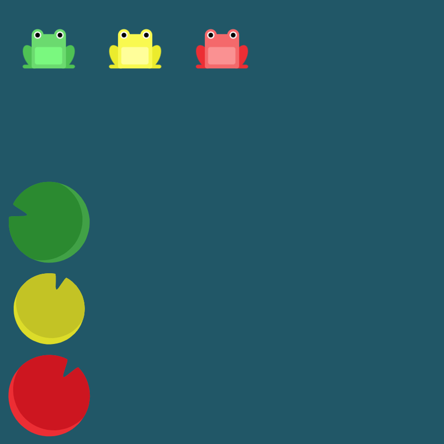

# Level 11 : flex-direction & justify-content

Combining `flex-direction` & `justify-content` practicing.

# Exercise



# Solution

:bulb: Basically just apply : 

```css
flex-direction: column;
justify-content: flex-end;
```

# Next step

[Link to next level](./level12.md) :muscle: