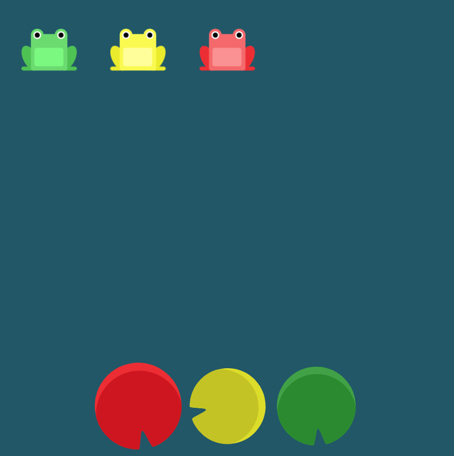

# Level 13 : flex-direction & justify-content & align-items

Combining `flex-direction` & `justify-content` & `align-items` practicing.

# Exercise



# Solution

:bulb: Basically just apply : 

```css
flex-direction: row-reverse;
align-items: flex-end;
justify-content: center;
```

# Next step

[Link to next level](./level14.md) :muscle: