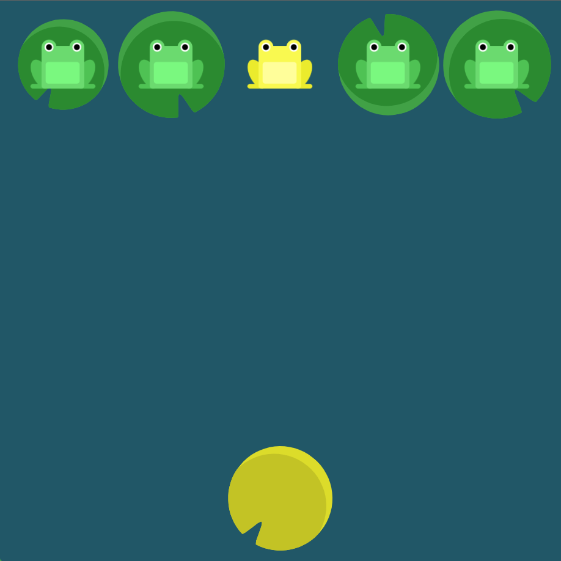

# Level 16 : align-self

Introducing the `align-self` property in order to ***align only one item vertically*** with same values as `align-items` : 
- `flex-start`: Item align to the top of the container.
- `flex-end`: Item align to the bottom of the container.
- `center`: Item align at the vertical center of the container.
- `baseline`: Item display at the baseline of the container.
- `stretch`: Item are stretched to fit the container.

# Exercise



# Solution

:bulb: Basically just apply : 

```css
.yellow
{
    align-self: flex-end;
}
```

# Next step

[Link to next level](./level17.md) :muscle: