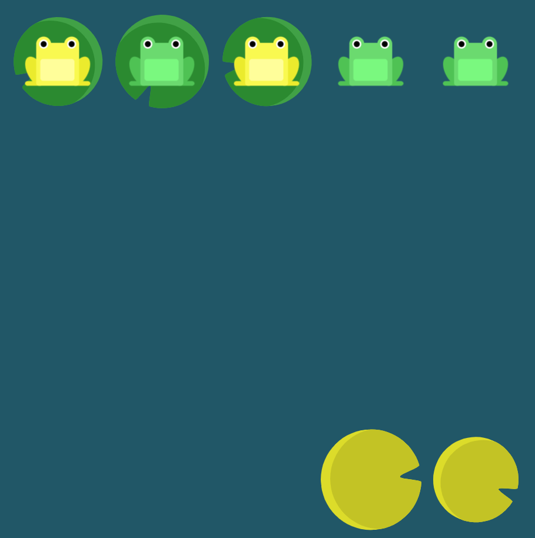

# Level 17 : align-self & order

Combining `align-self` & `order` practicing.

# Exercise



# Solution

:bulb: Basically just apply : 

```css
.yellow
{
    order: 1; // cause yellow to be on same lilypad column
    align-self: flex-end; // then just align vertically to the column end
}
```

# Next step

[Link to next level](./level18.md) :muscle: