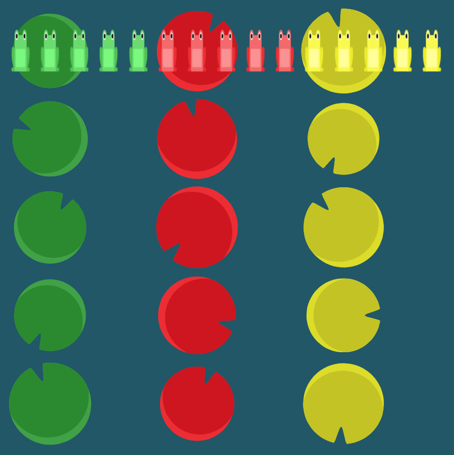

# Level 19 : flex-direction & flex-wrap

Combining `flex-direction` & `flex-wrap` practicing.

# Exercise



# Solution

:bulb: Basically just apply : 

```css
flex-direction: column;
flex-wrap: wrap;
```

# Next step

[Link to next level](./level20.md) :muscle: