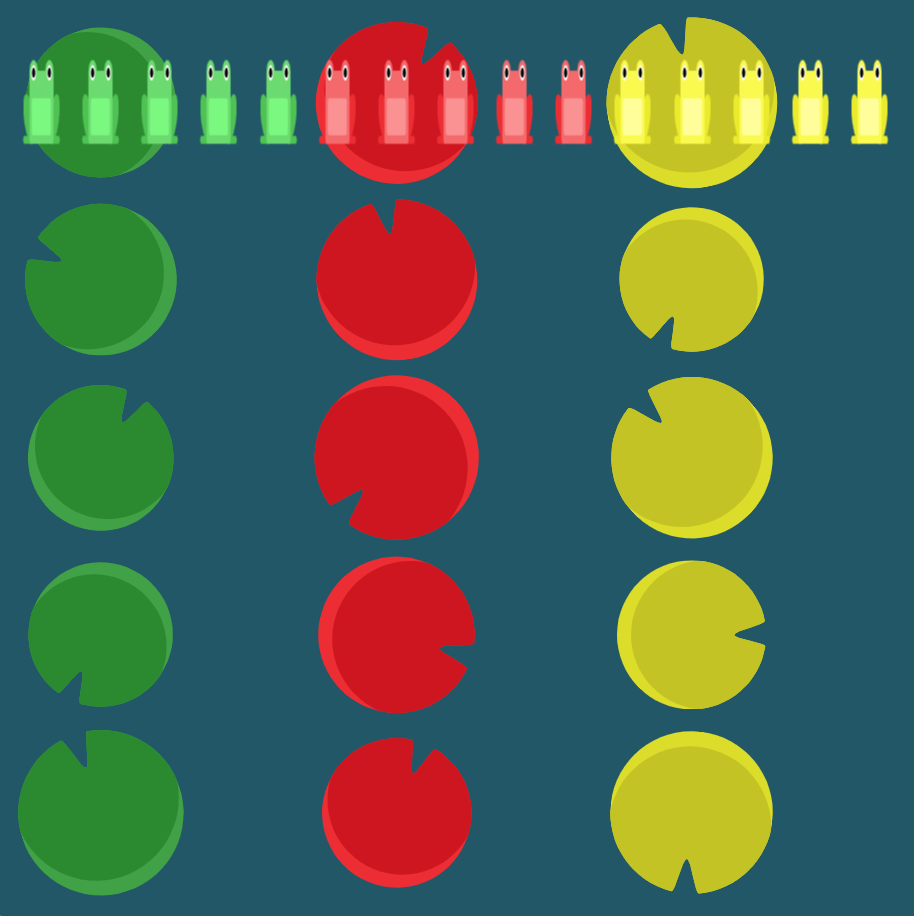

# Level 20 : flex-flow

Introducing the `flex-flow` property in order to **combine flex-direction and flex-wrap into one single property**.

&rarr; **flex-flow:** `flexDirectionValue` `flexWrapValue`

# Exercise

Same sample as exercise as [level 19](./level19.md) :eyes:



# Solution

:bulb: Basically just apply : 

```css
flex-flow: column wrap;
```

# Next step

[Link to next level](./level21.md) :muscle: