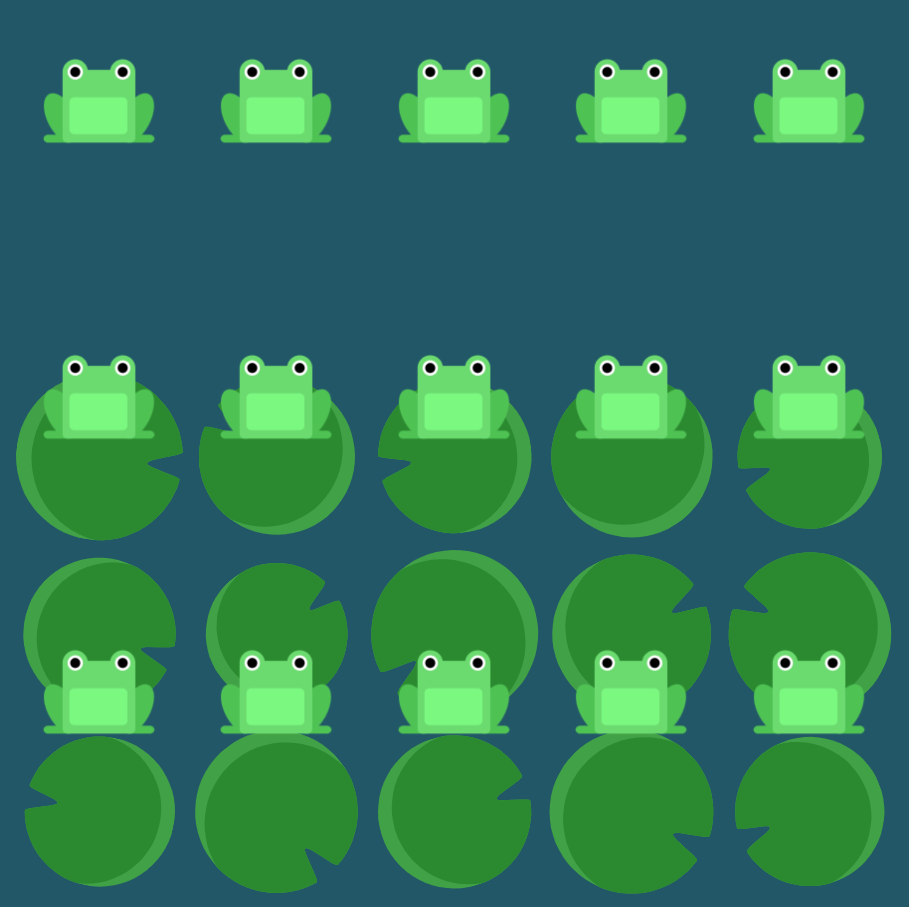

# Level 22 : align-content

Still practicing the `align-content` property.

# Exercise



# Solution

:bulb: Basically just apply : 

```css
flex-wrap: wrap;
align-content: flex-end;
```

# Next step

[Link to next level](./level23.md) :muscle: