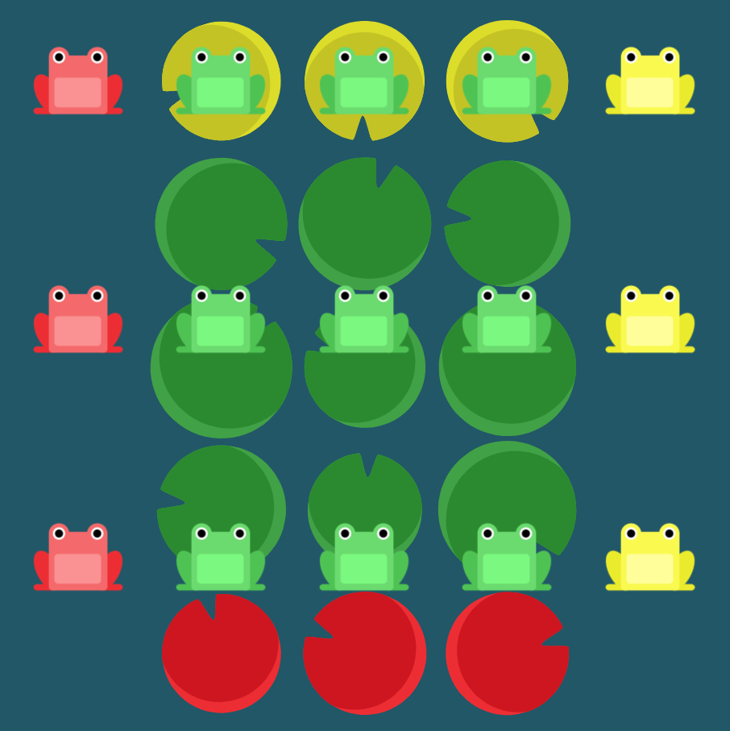

# Level 23 : flex-direction & align-content

Combining `flex-direction` & `align-content` practicing.

# Exercise



# Solution 

:bulb: Basically just apply : 

```css
flex-wrap: wrap;
flex-direction: column-reverse;
align-content: center;
```

# Next step

[Link to next level](./level24.md) :muscle: