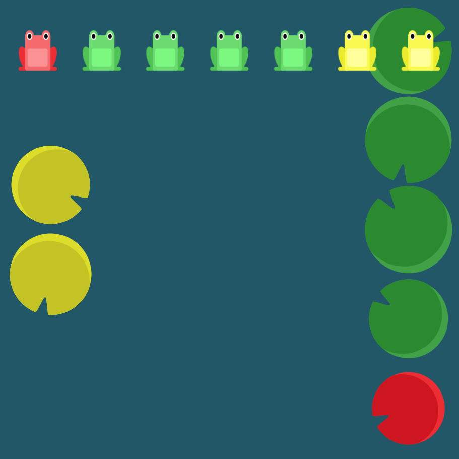

# Level 24 : Final one

Combine needed properties. :eyes:

Three level of solutions are possible (with 4, 3 and 2 lines of code) :mag:

# Exercise



# Solution

Let's explain go step by step :mag:

First turn into columns (as the instructions implies).
```css
flex-direction: column;
``` 

They're squeezed, we need to wrap them.
```css
flex-direction: column;
flex-wrap: wrap;
```

Now we have one column with red then greens and the second one with yellows.
Yellow column should be before green+red one, reverse it.
```css
flex-direction: column;
flex-wrap: wrap-reverse;
```

Now the green+red column should be reversed as the red appear should be at the end.
```css
flex-direction: column-reverse;
flex-wrap: wrap-reverse;
```

Green+red column is well placed, yellow one is quite is center instead of left container. We need to manage space between columns.
```css
flex-direction: column-reverse;
flex-wrap: wrap-reverse;
align-content: space-between;
```

Finally, align yellows in the center. 

:warning: We're in the column mode so alignment is horizontal (justify-content) not vertical (align-items).

```css
flex-direction: column-reverse; // first place in column 
flex-wrap: wrap-reverse;
align-content: space-between;
justify-content: center;
```

Et voilà :rocket:

# Better solutions

Remember ? `flex-direction` and `flex-wrap` can be simplified in `flex-flow` property. :sparkles:

Same with a last new property : `place-content` that mix `justify-content` and `align-content` like the following 

&rarr; **place-content:** `justifyContentValue` `alignContentValue`;


This result in the following best solution : 

```css
flex-flow: column-reverse wrap-reverse;
place-content: space-between center;
```