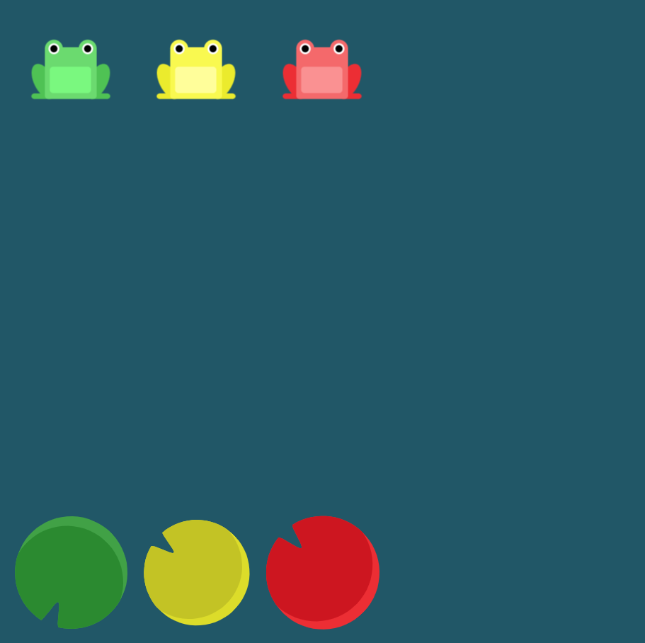

# Level 5 : align-items

Introducing the `align-items` property in order to ***align items vertically*** with several values : 
- `flex-start`: Items align to the top of the container.
- `flex-end`: Items align to the bottom of the container.
- `center`: Items align at the vertical center of the container.
- `baseline`: Items display at the baseline of the container.
- `stretch`: Items are stretched to fit the container.

# Exercise



# Solution

:bulb: Basically just apply : 

```css
align-items: flex-end;
```

# Next step

[Link to next level](./level6.md) :muscle: