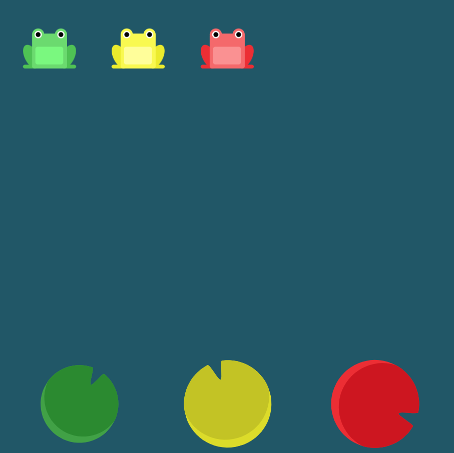

# Level 7 : justify-content & align-items

Combining `justify-content` & `align-items` practicing.

# Exercise



# Solution

:bulb: Basically just apply : 

```css
justify-content: space-around;
align-items: flex-end;
```

# Next step

[Link to next level](./level8.md) :muscle: