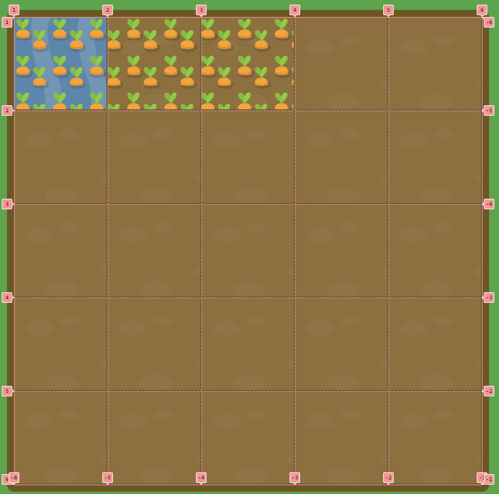
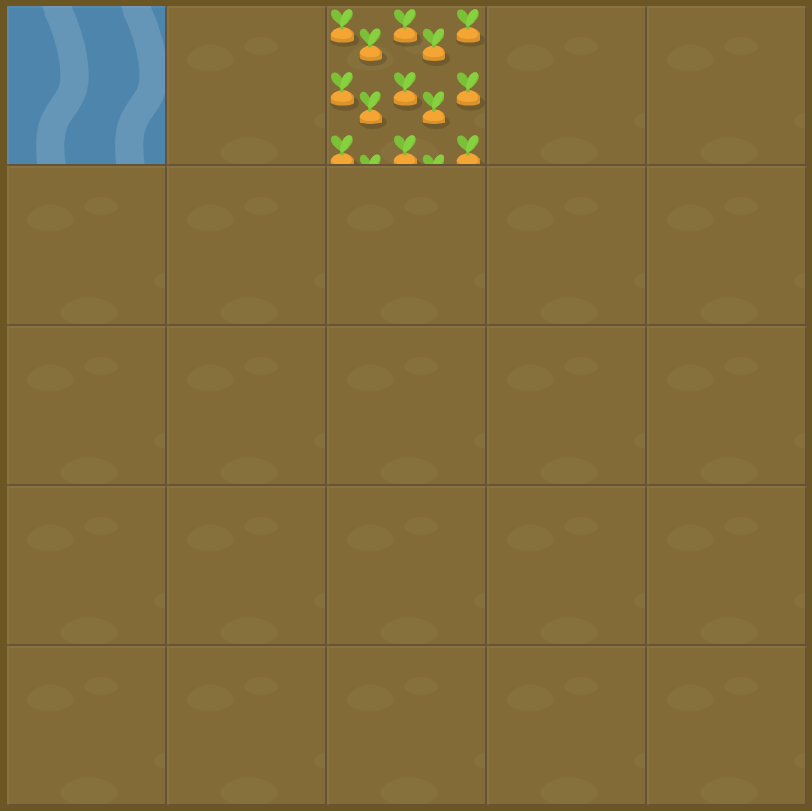

# Level 1 : grid-column-start

First the `grid` attribute &rarr; `display: grid;` allowing to turn on the ***grid mode*** for sub items.

It allows us to manage screen display with two dimensions : rows **and** columns.

> :bulb: Flex mode was only designed for layout in one dimension (row **or** column).

Introducing also the `grid-column-start` property in order to ***define specific grid item start position within grid columns*** with an integer.

:warning: Values are starting from 1 to columns + 1 as the following display implies 



Code sample provided also introduce two grid properties :
- `grid-template-columns` : defining line names and track sizing functions of grid columns
- `grid-template-rows` : defining line names and track sizing functions of grid rows

> :bulb: For instance here we have : 

```css 
#garden {
  display: grid;
  grid-template-columns: 20% 20% 20% 20% 20%; /* 5 columns with 20% of height size available each */
  grid-template-rows: 20% 20% 20% 20% 20%; /* 5 rows with 20% of width size available each */
}
```

# Exercise



# Solution

:bulb: Basically just apply : 

```css
#water{
    grid-column-start: 3;
}
```

# Next step

[Link to next level](./level2.md) :muscle: