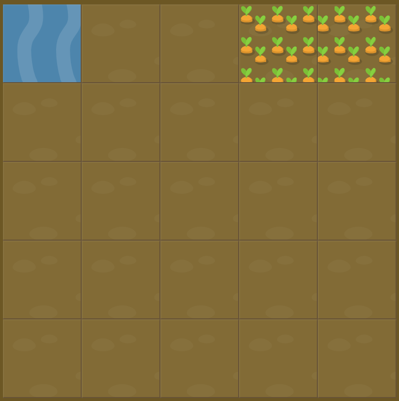

# Level 10 : grid-column

Introducing the `grid-column` property in order to ***combine both grid-column-start and grid-column-end*** with both values separated by a slash.

For instance :

```css
  grid-column: gridColumnStartValue / gridColumnEndValue;
```

# Exercise



# Solution

:bulb: Basically just apply : 

```css
#water {
  grid-column: 4 / 6;
}
```

# Next step

[Link to next level](./level11.md) :muscle: