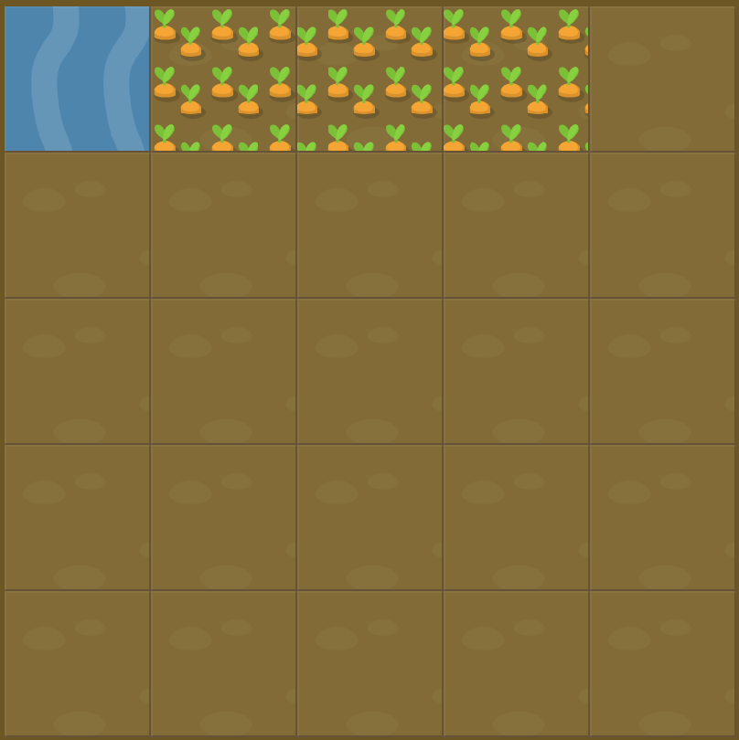

# Level 11 : grid-column

Still practicing the `grid-column`  but with `span value` this time.

# Exercise



# Solution

:bulb: Basically just apply : 

```css
#water {
  grid-column: 2 / span 3; /* span 3 / 5; also works */
}
```

# Next step

[Link to next level](./level12.md) :muscle: