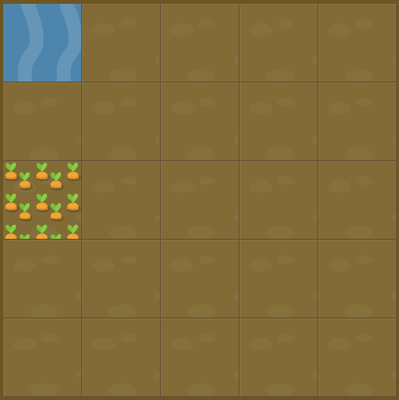

# Level 12 : grid-row-start & grid-row-end

Introducing the `grid-row-start` property in order to ***define specific grid item start position within grid rows*** with an integer.

Mentionning also the `grid-row-end` property in order to ***define specific grid item end position within grid rows*** with an integer.

# Exercise



# Solution

:bulb: Basically just apply : 

```css
#water {
  grid-row-start: 3;
}
```

# Next step

[Link to next level](./level13.md) :muscle: