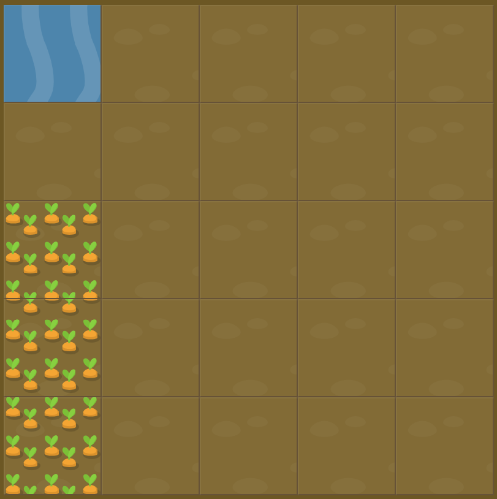

# Level 13 : grid-row

Introducing the `grid-row` property in order to **combine both grid-row-start and grid-row-end** with both values separated by a slash.

For instance :

  grid-row: gridRowStartValue / gridRowEndValue;

# Exercise



# Solution

:bulb: Basically just apply : 

```css
#water {
  grid-row: 3 / 6;
}
```

# Next step

[Link to next level](./level14.md) :muscle: