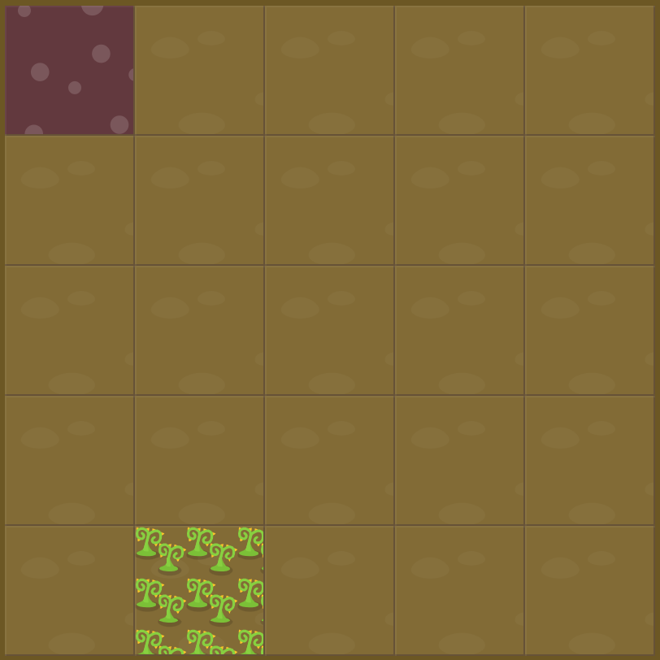

# Level 14 : grid-row & grid-column

Combining `grid-row` & `grid-column` practicing.

# Exercise



# Solution

:bulb: Basically just apply : 

```css
#poison {
  grid-column: 2 / 3;
  grid-row: 5 / 6;
}
```

# Next step

[Link to next level](./level15.md) :muscle: