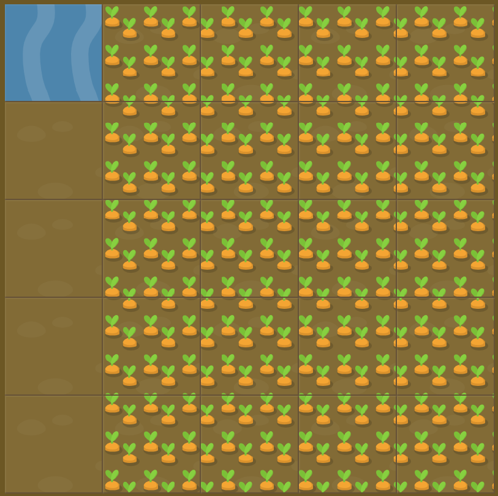

# Level 15 : grid-row & grid-column

Combining `grid-row` & `grid-column` practicing.

Usage of `spans` could be usefull. :eyes:

# Exercise



# Solution

:bulb: Basically just apply : 

```css
#water {
  grid-column: 2 / span 4;
  grid-row: span 5; /* no need for a start, all rows should be watered */
}
```

# Next step

[Link to next level](./level16.md) :muscle: