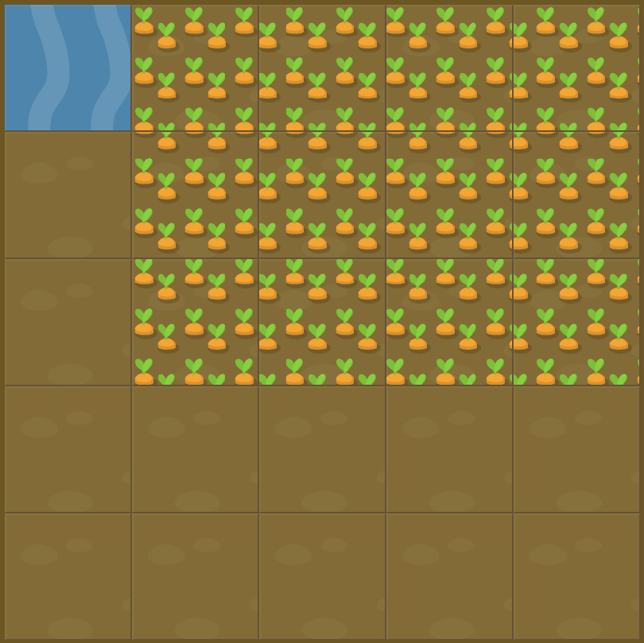

# Level 16 : grid-area

Introducing the `grid-area` property in order to **combine both grid-row and grid-column** into one single property.

```css
  grid-area: gridRowStartValue / gridColumnStartValue / gridRowEndValue / gridColumnEndValue;
```

# Exercise



# Solution

:bulb: Basically just apply : 

```css
#water {
  grid-area: 1 / 2 / span 3 / span 4; /* 1/2/4/6 also works */
}
```

# Next step

[Link to next level](./level17.md) :muscle:

