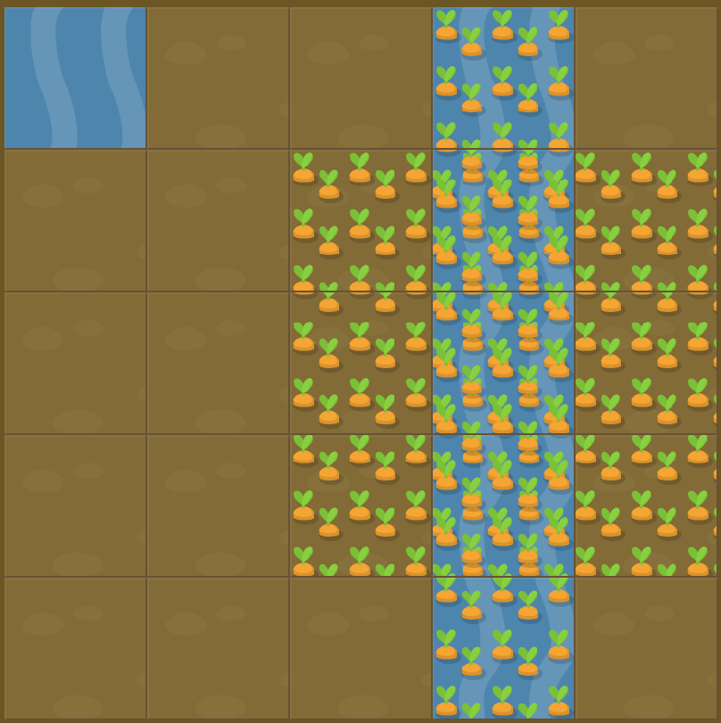

# Level 17 : grid-area

Still practicing the `grid-area` property.

# Exercise



Code for already watered carrots : 

```css
#water-1 {
  grid-area: 1 / 4 / 6 / 5;
}
```

# Solution

:bulb: Basically just apply : 

```css
#water-2 {
  grid-area: 2 / 3 / span 3 / span 3;
}
```

# Next step

[Link to next level](./level18.md) :muscle:

