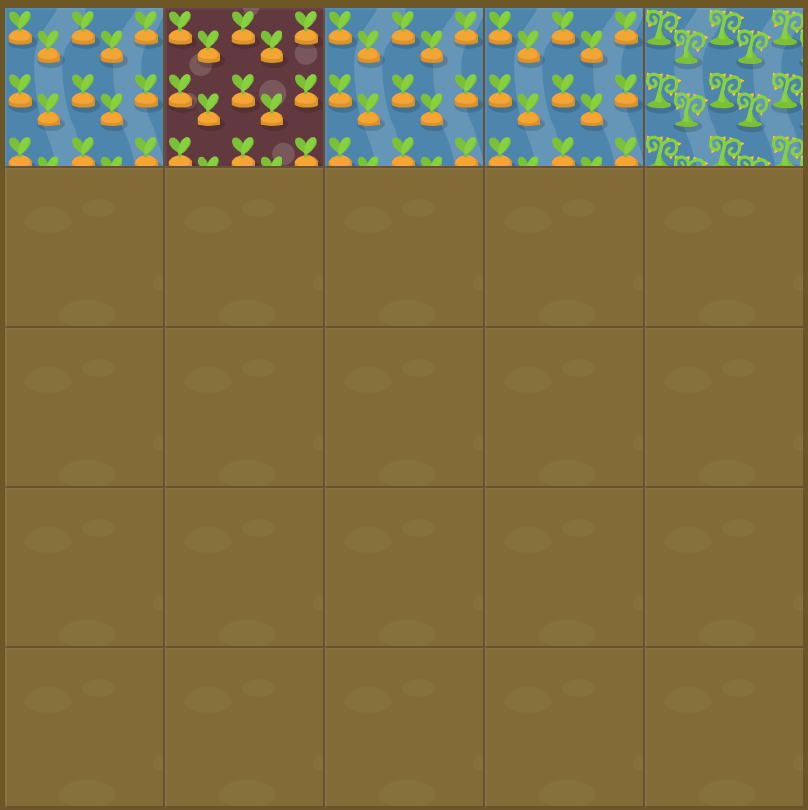

# Level 18 : order

Introducing the `order` property in order to **override item order** with an integer.

Default value is 0 for all items.

# Exercise



Code for water : 

```css
#water {
  order: 0;
}
```

# Solution

:bulb: Basically just apply : 

```css
#poison {
  order: 1; /* as weed is the last item of the list */
}
```

# Next step

[Link to next level](./level19.md) :muscle:

