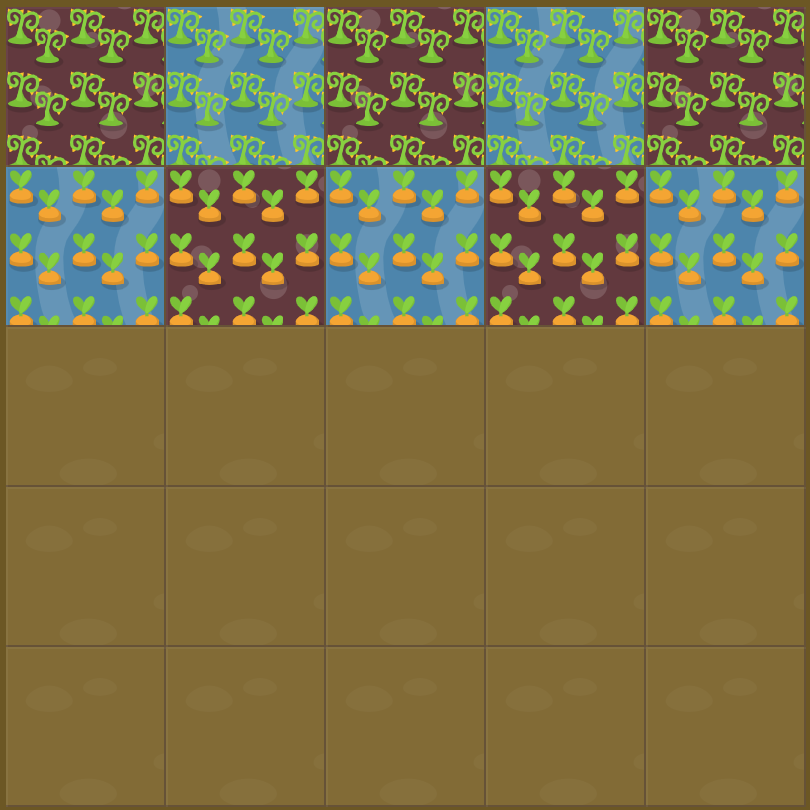

# Level 19 : order

Still practicing the `order` property.

# Exercise



Code for water : 

```css
#water {
  order: 0;
}
```

# Solution

:bulb: Basically just apply : 

```css
#poison {
  order: -1; /* poisoned weeds first and then watered carrots  */
}
```

# Next step

[Link to next level](./level20.md) :muscle:

