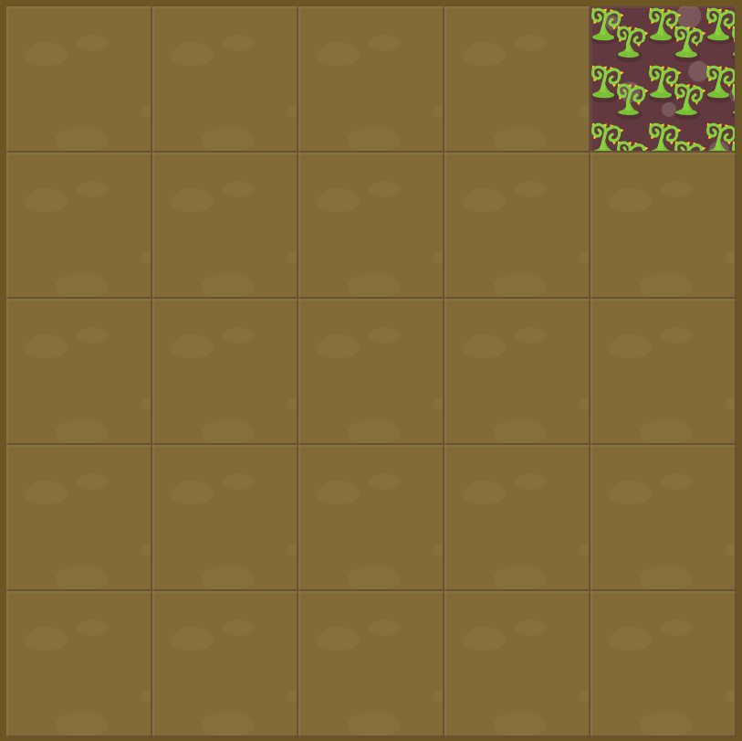

# Level 2 : grid-column-start

Still practicing the `grid-column-start` property.

# Exercise



# Solution

:bulb: Basically just apply : 

```css
#poison{
  grid-column-start: 5;
}
```

# Next step

[Link to next level](./level3.md) :muscle: