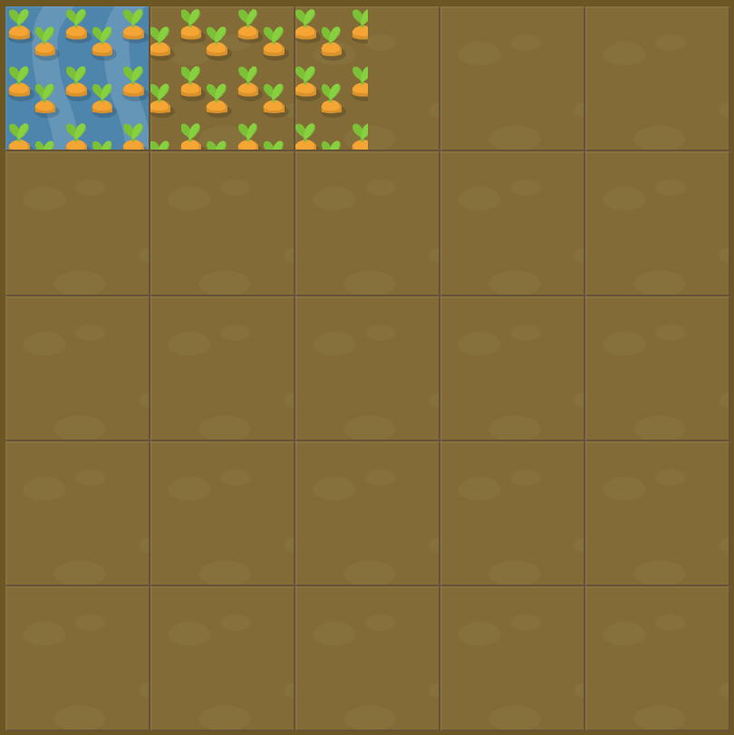

# Level 20 : grid-template-columns

Practicing the `grid-template-columns` property.

# Exercise



Code for water : 

```css
#water {
  grid-column: 1;
  grid-row: 1;
}
```

# Solution

:bulb: Basically just apply : 

```css
#garden {
  display: grid;
  grid-template-columns: 50%;
  grid-template-rows: 20% 20% 20% 20% 20%;
}
```

:bulb: Water definition implies that we only have one column so our grid-template-columns should only contains one value. Also carrots are defined to be half the playground size, that's why the value is 50%.

# Next step

[Link to next level](./level21.md) :muscle:

