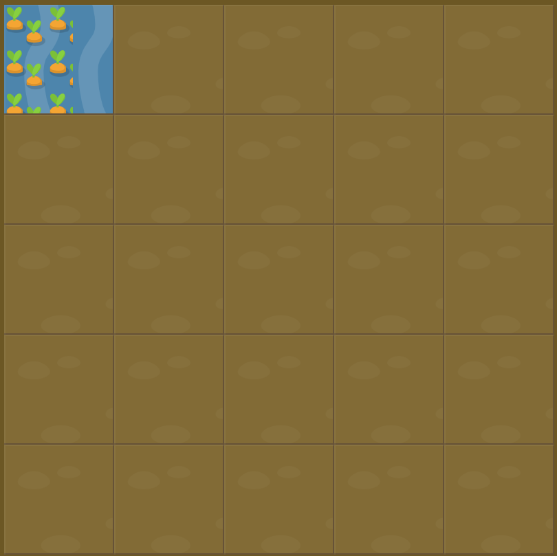

# Level 21 : grid-template-columns & repeat

Introducing the `repeat` function `grid-template-columns` for property in order to **simplify identical widths definition**.

For instance : 

```css
  grid-template-columns: 20% 20% 20% 20% 20%;
```

could become :

```css
grid-template-columns: repeat(5, 20%);
```

# Exercise



Code for water : 

```css
#water {
  grid-column: 1;
  grid-row: 1;
}
```

:mag: Goal is to avoid overwatering the garden by reducing garden size.

# Solution

:bulb: Basically just apply : 

```css
#garden {
  display: grid;
  grid-template-columns: repeat(1, 12.5%);
  grid-template-rows: 20% 20% 20% 20% 20%;
}
```

# Next step

[Link to next level](./level22.md) :muscle:

