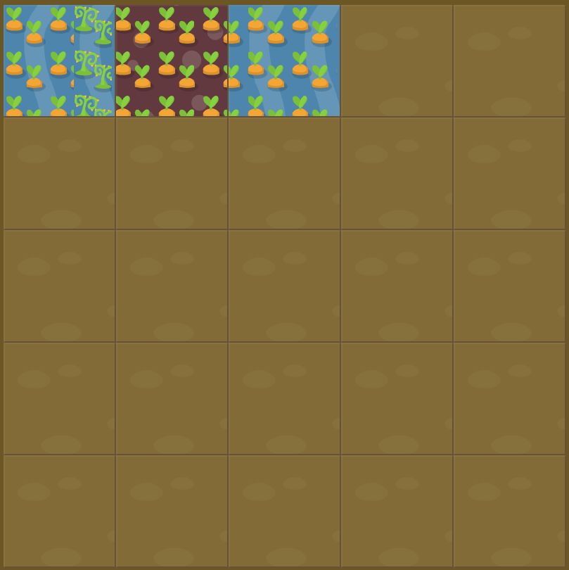

# Level 22 : grid-template-columns with px, em, %

Practicing the `grid-template-columns` property using both pixels, em and percentages.

:bulb: Units definition : 
- `px` : hardcoded pixel value

&rarr; Usage = Should **only** be used for elements that will not be resized depending on screen size. **Majorly used for font sizing**.

- `em` : pixels ratio relative to parent element font size

&rarr; Usage = Need to scale element based on parent element (whether it's size is). **Majorly used for font sizing**.

- `rem` : same as EM but relative to root element (top div for instance)

&rarr; Usage = Use it first and then EM for more granularity. **Majorly used for font sizing**.

:bulb: For instance, default font size is 16px. Then 1em would equals = 16px (1*16), 2em = 32px, .5em = 8px, etc.

- `vw` : relative to viewport width

&rarr; Usage = Margins, padding, spacing, width / heights.

- `vh` : relative to viewport height

&rarr; Usage = Usage = Margins, padding, spacing, width / heights.

:bulb: For instance with a mobile device (480px x 800px): 1VW = 1% of viewport width = 4.8px.

- `%` : similar to VW & VH but relative on parent element not viewport width / heigth

&rarr; Usage = Usage = Margins, padding, spacing, width / heights.

# Exercise



# Solution

:bulb: Basically just apply : 

```css
#garden {
  display: grid;
  grid-template-columns: 100px 3em 40%;
  grid-template-rows: 20% 20% 20% 20% 20%;
}
```

# Next step

[Link to next level](./level23.md) :muscle:

