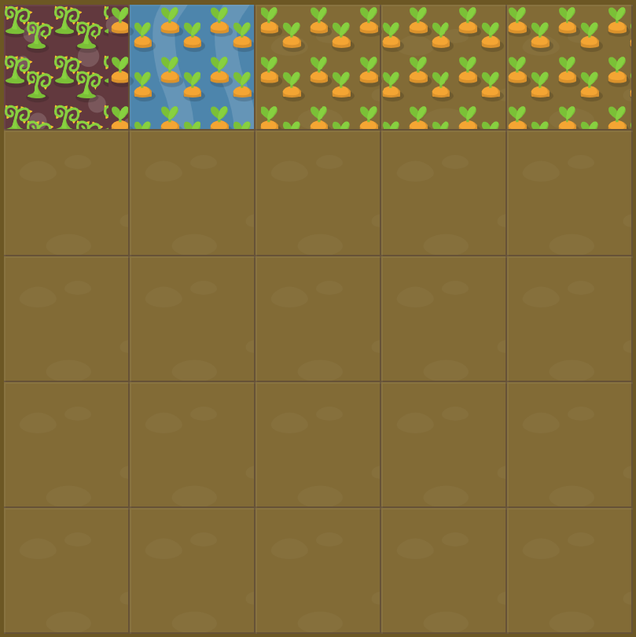

# Level 23 : grid-template-columns with fractionnals

Practicing the `grid-template-columns` property using fractionnals : `fr`.

:bulb: Unit definition : 
- `fr` : allocates one share of the available space
  &rarr; Means that if two elements are set to **1fr** and **3fr** respectively, the space is divided into 4 equals shares; the first element occupies 1/4 and the second element 3/4 of any leftover space.

# Exercise



:mag: Weeds make up the left 1/6 of the first row . Carots take the remaining 5/6.

# Solution

:bulb: Basically just apply : 

```css
#garden {
  display: grid;
  grid-template-columns: 1fr 5fr;
  grid-template-rows: 20% 20% 20% 20% 20%;
}
```

# Next step

[Link to next level](./level24.md) :muscle:

