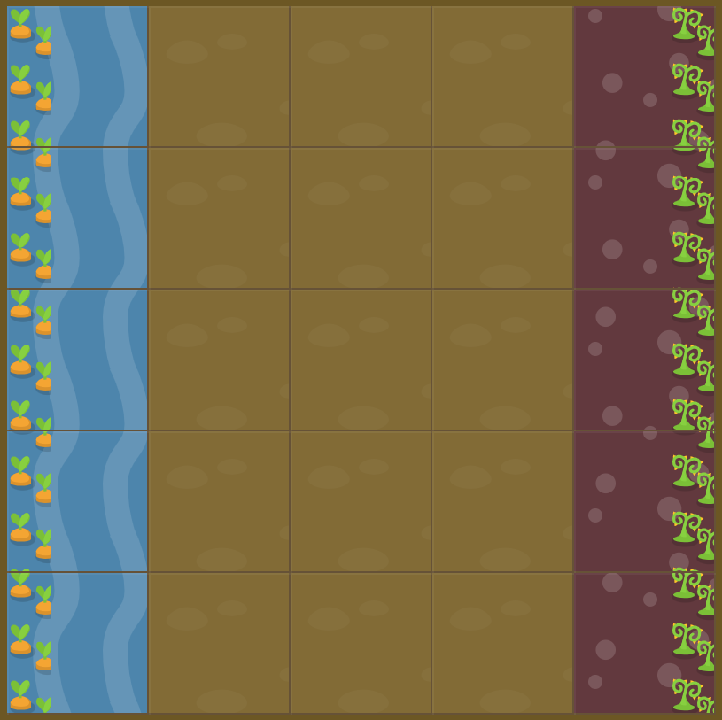

# Level 24 : grid-template-columns with fractionnals

Practicing the `grid-template-columns` property using fractionnals : `fr`.

# Exercise



:mag: Some clues : 

:one: Carots form a 50 pixel on the left, and the weeds a 50 pixel column on the right. Poison should only be on weeds and water only on carots. So first column with watered carrots, last with poisoned weeds and three more columns to take up the remaining space

:two: Water is defined like this : 

```css
/* first column */
#water {
  grid-area: 1 / 1 / 6 / 2;
}
```

:three: Poison is defined like this :
```css
/* last column*/
#poison {
  grid-area: 1 / 5 / 6 / 6;
}
```

# Solution

:bulb: Basically just apply : 

```css
#garden {
  display: grid;
  grid-template-columns: 50px 2fr 9fr 2fr 50px; /* 1fr 2fr 9fr 2fr 1fr also works */
  grid-template-rows: 20% 20% 20% 20% 20%;
}
```

# Next step

[Link to next level](./level25.md) :muscle:

