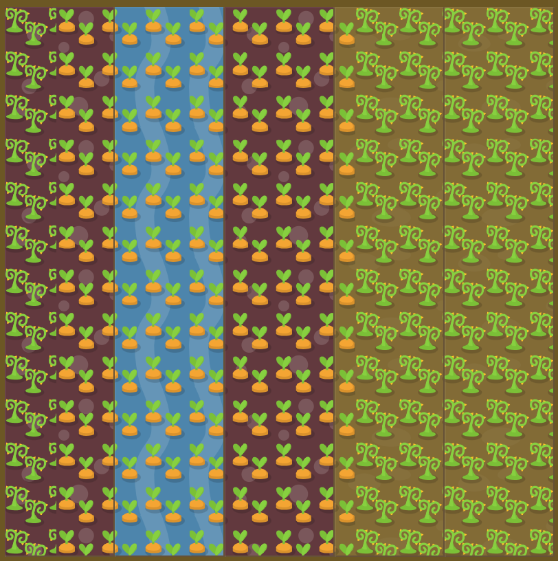

# Level 25 : grid-template-columns with units

Practicing the `grid-template-columns` property using available units.

# Exercise



:mag: Some clues : 

75 pixel column of weeds on the left side of your garden. 3/5 of the remaining space is growing carrots, while 2/5 has been overrun with weeds.

:bulb: Try only using px & fr.

# Solution

:bulb: Basically just apply : 

```css
#garden {
  display: grid;
  grid-template-columns: 75px 3fr 2fr;
  grid-template-rows: 100%; /* all rows are filled */
}
```

# Next step

[Link to next level](./level26.md) :muscle:

