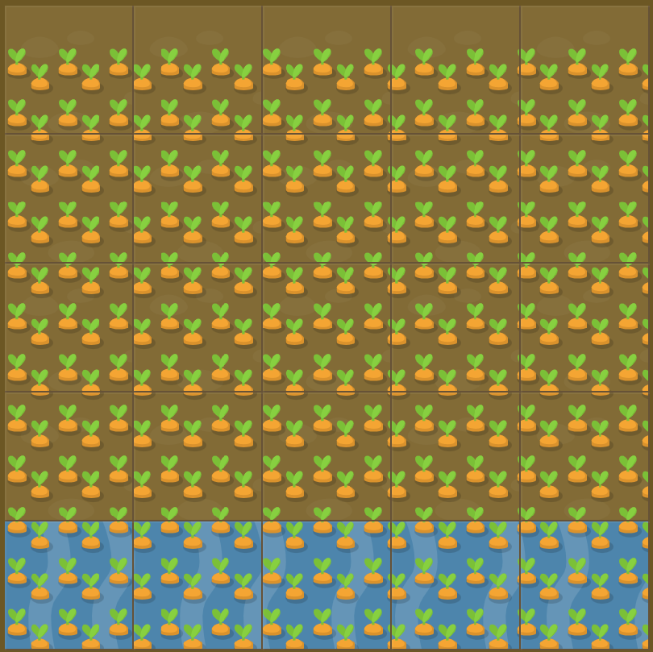

# Level 26 : grid-template-rows with units

Practicing the `grid-template-rows` property using available units.

# Exercise



:mag: Some clues : 

:one: Should water all but the top 50 pixels of your garden. Note that the water is set to fill only your 5th row, so you'll need to create 5 rows in total.

:two: Water is defined like :
```css
/* Only last row (fifth) */
#water {
  grid-column: 1 / 6;
  grid-row: 5 / 6;
}
```

# Solution

:bulb: Basically just apply : 

```css
#garden {
  display: grid;
  grid-template-columns: 20% 20% 20% 20% 20%;
  grid-template-rows: 50px 0fr 0fr 0fr 1fr; 
}
```

:mag: Water is on last row (fifth one) so it should take all the remaining space, that's why other carots rows are 0fr. That way rows 2,3,4 of garden aren't displayed, only the last one with water is.

# Next step

[Link to next level](./level27.md) :muscle:

