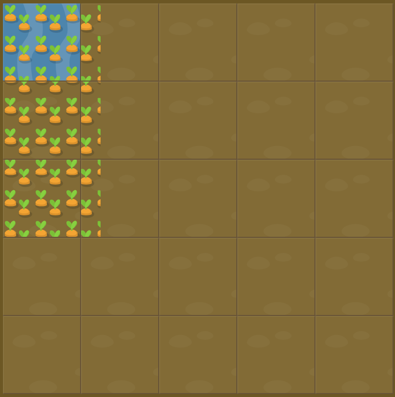

# Level 27 : grid-template

Introducing the `grid-template` property in order to **combine both grid-template-rows and grid-template-columns values** such as :

```css
    grid-template: gridTemplateRowsValue / gridTemplateColumnsValue
``` 

:bulb: For instance : 

```css
    grid-template: 50% 50% / 200px;
``` 

would create a grid with two equals rows of one column 200px high.

# Exercise



:mag: Some clues : 

:one: Should water the carrots area which is the 60% top of the garden and 200px large.

:two: Water is defined like :
```css
/* first cell of grid */
#water {
  grid-column: 1;
  grid-row: 1;
}
```

&rarr; Means we have at least 2 rows (one with 60%, and the rest for the second) and 2 columns (one with 200px, and the rest for the second).

# Solution

:bulb: Basically just apply : 

```css
/* watered garden is 60% filled with water, rest isnt separated in multiple garden dry rows */
/* same on columns but 200px is watered instead */
#garden {
  display: grid;
  grid-template: 60% 1fr / 200px 1fr; /* 60% 40% also works for rows but 1fr is better to use as "fill the rest" unit */
}
```

# Next step

[Link to next level](./level28.md) :muscle:
