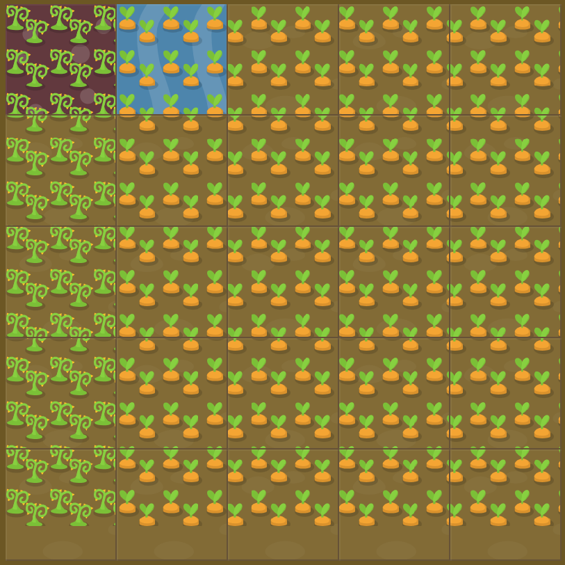

# Level 28 : Final one

Combine needed properties. :eyes:

# Exercise



:mag: Some clues : 

Your garden is looking great. Here you've left a 50 pixel path at the bottom of your garden and filled the rest with carrots.

Unfortunately, the left 20% of your carrots have been overrun with weeds. Use CSS grid one last time to treat your garden.

# Solution

First let's handle the two rows : one with empty garden, the other with weeds & carrots.

```css
  grid-template-rows: 1fr 50px;
```

Then weeds seems to take 1/5 of the garden leaving 4/5 for carrots.

```css
  grid-template-columns: 1fr 4fr;
```

This result, combining them, as a well maintained garden :rocket:

```css
  grid-template: 1fr 50px / 1fr 4fr;
```
