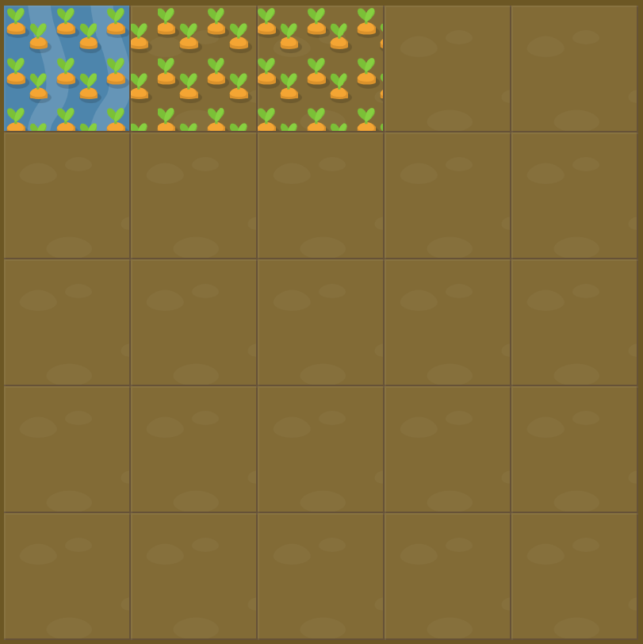

# Level 3 : grid-column-end

Introducing the `grid-column-end` property in order to ***define specific grid item end position within grid columns*** with an integer as value starting from 1.

Could be combine with grid-column-start for instance in order to apply some display on multiple item in a row. :eyes:

# Exercise



# Solution

:bulb: Basically just apply : 

```css
#water {
  grid-column-start: 1;
  grid-column-end: 4;
}
```

# Next step

[Link to next level](./level4.md) :muscle: