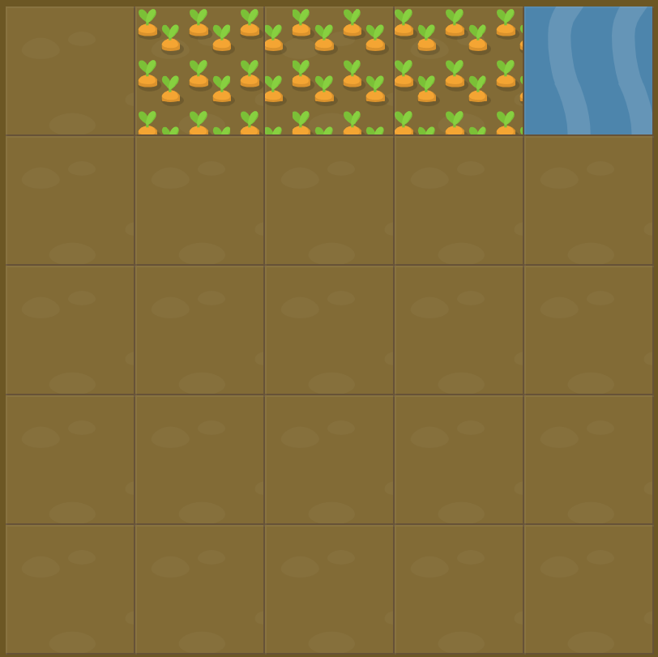

# Level 4 : grid-column-start & grid-column-end

Combining `grid-column-start` & `grid-column-end` practicing.

:bulb: **grid-column-end** doesn't necessarily have to be bigger than **grid-column-start**, we can reverse it.

# Exercise



# Solution

:bulb: Basically just apply : 

```css
#water {
  grid-column-start: 5;
  grid-column-end: 2;
}
```

# Next step

[Link to next level](./level5.md) :muscle: