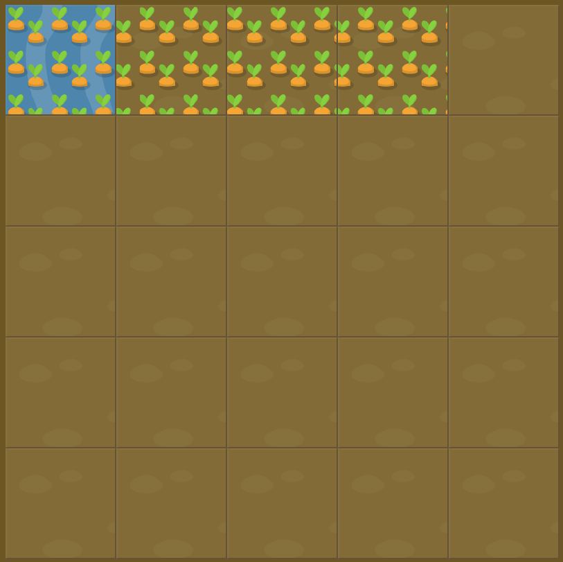

# Level 5 : grid-column-start & grid-column-end

Combining `grid-column-start` & `grid-column-end` practicing.

:bulb: **grid-column-start** and **grid-column-end** can also be negative &rarr; it will start counting from left to right instead of right to left.

# Exercise



# Solution

:bulb: Basically just apply : 

```css
#water {
  grid-column-start: 1;
  grid-column-end: -2;
}
```

# Next step

[Link to next level](./level6.md) :muscle: