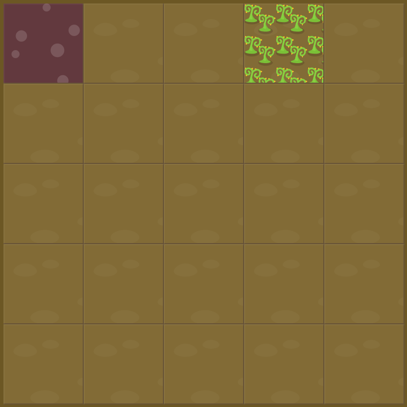

# Level 6 : grid-column-start

Still practicing `grid-column-start`.

# Exercise



# Solution

:bulb: Basically just apply : 

```css
#water {
  grid-column-start: -3; /* 4 also works */  
}
```

# Next step

[Link to next level](./level7.md) :muscle: