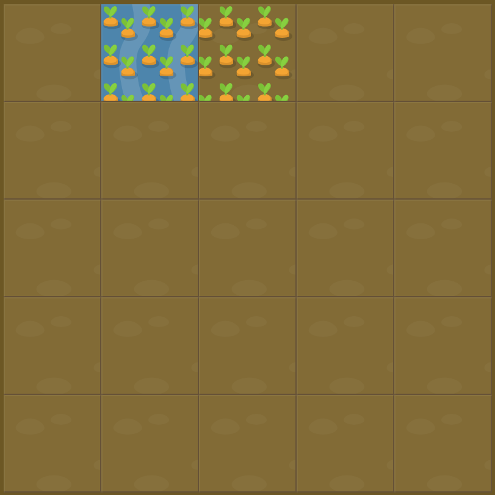

# Level 7 : grid-column-end span

Introducing the `span value` for the `grid-column-end` property in order to ***define the column width instead of grid lines positions*** with a positive integer starting from 1.

# Exercise



# Solution

:bulb: Basically just apply : 

```css
#water {
  grid-column-start: 2;
  grid-column-end: span 2;
}
```

# Next step

[Link to next level](./level8.md) :muscle: