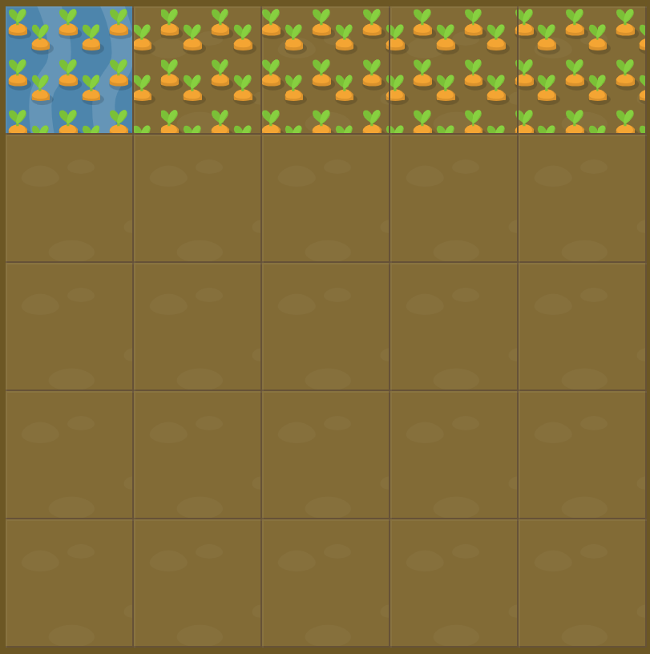

# Level 8 : grid-column-end span

Still practicing the `grid-column-end` property with `span value`.

# Exercise



# Solution

:bulb: Basically just apply : 

```css
#water {
  grid-column-start: 1;
  grid-column-end: span 5;
}
```

# Next step

[Link to next level](./level9.md) :muscle: