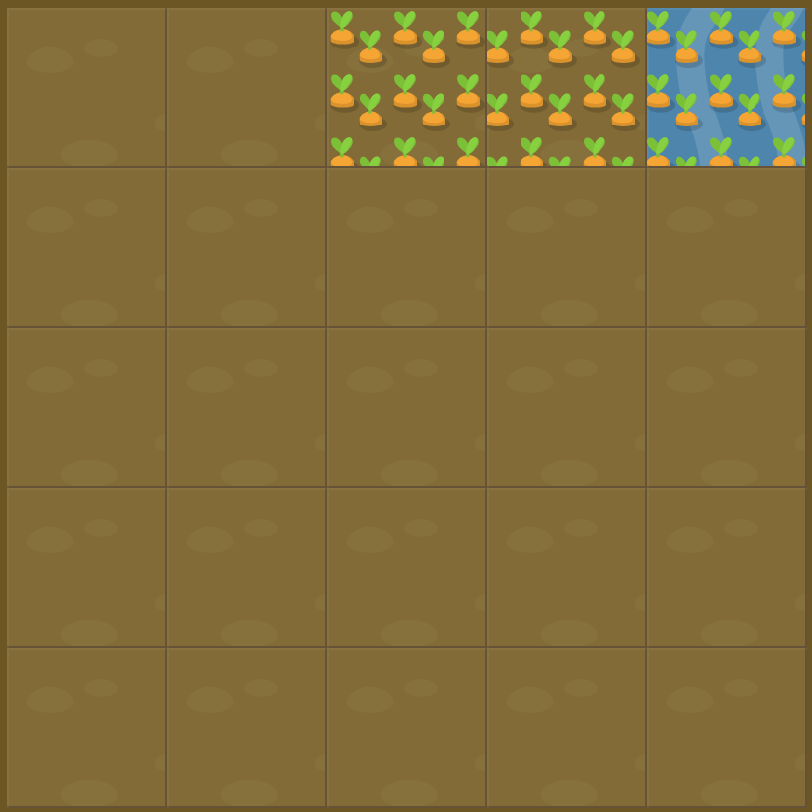

# Level 9 : grid-column-start span

Still practicing the `span value` but for `grid-column-span` this time.

# Exercise



# Solution

:bulb: Basically just apply : 

```css
#water {
  grid-column-start: 3;
  grid-column-end: 6;
}
```

# Next step

[Link to next level](./level10.md) :muscle: